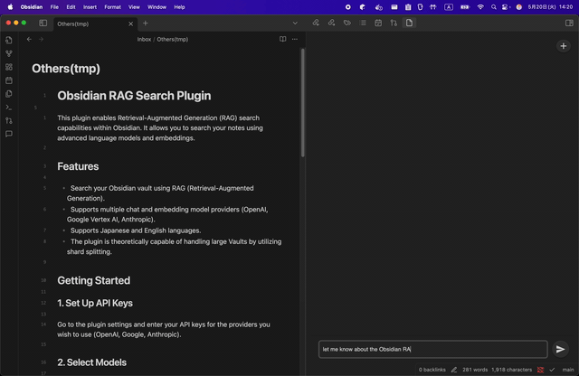

# Obsidian RAG Search Plugin

This plugin enables Retrieval-Augmented Generation (RAG) search capabilities within Obsidian. It allows you to search your notes using advanced language models and embeddings.

## Features

-   Search your Obsidian vault using RAG (Retrieval-Augmented Generation).
-   Supports multiple chat and embedding model providers (OpenAI, Google Vertex AI, Anthropic).
-   Supports Japanese and English languages.
-   The plugin is theoretically capable of handling large Vaults by utilizing shard splitting.

## Getting Started

### 1. Set Up API Keys

Go to the plugin settings and enter your API keys for the providers you wish to use (OpenAI, Google, Anthropic).

### 2. Select Models

In the settings, choose your preferred chat model and embedding model. Only certain models are supported; available options are shown in the dropdowns.

### 3. Reindex Documents

After configuring your models, reindex your vault:

-   Use the command palette and run `reindex documents`, or
-   Use the UI prompt if you open the chat view before indexing.

This will prepare your notes for RAG-based search.

### 4. Start Searching

Open the RAG Chat view from the ribbon icon or command palette. You can now interact with your notes using the selected models.

## Supported Models

The list of supported chat and embedding models is limited and defined in the code. For embeddings, examples include:

-   OpenAI: `text-embedding-3-small`, `text-embedding-3-large`
-   Google Vertex AI: `text-embedding-004`

For chat models, options include OpenAI (e.g., `gpt-4o`), Anthropic, and Google Gemini models.

## Notes

-   You must reindex your documents whenever you change the embedding model or add new notes.
-   API keys are stored securely in your Obsidian settings.
-   The plugin creates a `.rag-chat` directory in your vault for storing vector data.

## License

See [LICENSE](./LICENSE) for details.
